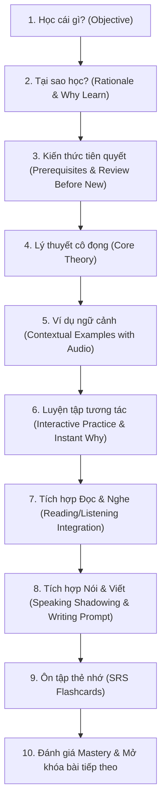

# 🇷🇺 RUSSIAN CURRICULUM COVERAGE MATRIX (TRKI A0 — B1)
**Nền tảng:** `Русский Master` (Hệ điều hành học tiếng Nga toàn diện)  
**Khung chuẩn:** TRKI / TORFL (*Тест по русскому языку как иностранному*) — CEFR (A0 đến B1.1)

---

## 📊 1. Ma Trận Bao Phủ 6 Kỹ Năng Sư Phạm (Full Multi-Skill Matrix)

Để đảm bảo tính trung thực học thuật, mỗi mục tiêu học tập (**Learning Objective**) trong hệ thống được đối soát và phân loại mức độ bao phủ thực tế theo 6 khía cạnh: **Ngữ pháp (Grammar)**, **Từ vựng (Vocab)**, **Đọc hiểu (Reading)**, **Nghe hiểu (Listening)**, **Luyện nói (Speaking)**, và **Luyện viết (Writing)**.

### Phân loại trạng thái bao phủ:
- **FULL**: Đầy đủ cả 6 kỹ năng và bài tập thực hành khép kín.
- **PARTIAL**: Bao phủ 4-5 kỹ năng, đang tiếp tục hoàn thiện phần luyện tập mở rộng.
- **GRAMMAR_ONLY**: Chỉ mới có lý thuyết ngữ pháp và bài tập trắc nghiệm.
- **INPUT_ONLY**: Có phần Đọc/Nghe nhưng thiếu phần luyện Nói/Viết chủ động.

| Mã Mục Tiêu | Cấp độ | Tên Mục Tiêu Sư Phạm | Ngữ pháp | Từ vựng | Đọc hiểu | Nghe hiểu (TTS) | Luyện nói (Shadowing) | Luyện viết (Rubric) | Trạng Thái Bao Phủ |
| :--- | :--- | :--- | :---: | :---: | :---: | :---: | :---: | :---: | :---: |
| `RUS-PRE-01` | **Pre-A1** | Bảng chữ cái Cyrillic & Nhận diện âm | ✓ | ✓ | ✓ | ✓ | ✓ (A/B) | ✓ (Chép chữ) | **FULL** |
| `RUS-PRE-02` | **Pre-A1** | Bậc thang đọc âm tiết & Quy tắc giảm âm `О/Е/Я` | ✓ | ✓ | ✓ | ✓ | ✓ (A/B) | ✓ (Đánh dấu ́) | **FULL** |
| `RUS-PRE-03` | **Pre-A1** | Vô thanh hóa & Đồng hóa phụ âm | ✓ | ✓ | ✓ | ✓ | ✓ (A/B) | ✓ (Chính tả) | **FULL** |
| `RUS-A1-01` | **A1.1** | Đại từ nhân xưng & Tự giới thiệu bản thân | ✓ | ✓ | ✓ | ✓ | ✓ (A/B) | ✓ | **FULL** |
| `RUS-A1-02` | **A1.1** | Giống danh từ (*он, она, оно*) & Chuỗi liên kết | ✓ | ✓ | ✓ | ✓ | ✓ (A/B) | ✓ | **FULL** |
| `RUS-A1-03` | **A1.1** | Động từ nhóm 1 thì hiện tại (*-ать / -ять*) | ✓ | ✓ | ✓ | ✓ | ✓ (A/B) | ✓ | **FULL** |
| `RUS-A1-04` | **A1.2** | Cách 4 (Đối cách trực tiếp `вижу кого/что`) | ✓ | ✓ | ✓ | ✓ | ✓ (A/B) | ✓ | **FULL** |
| `RUS-A1-05` | **A1.2** | Cách 6 (Giới cách vị trí `где? в/на` & chủ đề `о ком?`) | ✓ | ✓ | ✓ | ✓ | ✓ (A/B) | ✓ | **FULL** |
| `RUS-A1-06` | **A1.2** | Cách 2 (Sinh cách sở hữu & phủ định `нет кого/чего`) | ✓ | ✓ | ✓ | ✓ | ✓ (A/B) | ✓ | **FULL** |
| `RUS-A2-01` | **A2.1** | Cách 3 (Dữ cách `кому/чему`, tuổi tác, `нравится`) | ✓ | ✓ | ✓ | ✓ | ✓ (A/B) | ✓ | **FULL** |
| `RUS-A2-02` | **A2.1** | Cách 5 (Tạo cách nghề nghiệp & cùng với ai `с кем`) | ✓ | ✓ | ✓ | ✓ | ✓ (A/B) | ✓ | **FULL** |
| `RUS-A2-03` | **A2.1** | Cặp thể động từ НСВ/СВ theo ngữ cảnh đối chiếu | ✓ | ✓ | ✓ | ✓ | ✓ (A/B) | ✓ | **FULL** |
| `RUS-A2-04` | **A2.2** | Động từ chuyển động 1 chiều (*идти*) vs đa chiều (*ходить*) | ✓ | ✓ | ✓ | ✓ | ✓ (A/B) | ✓ | **FULL** |
| `RUS-A2-05` | **A2.2** | 11 Tiền tố chuyển động chỉ hướng (*при-, у-, в-, вы-...*) | ✓ | ✓ | ✓ | ✓ | ✓ (A/B) | ✓ | **FULL** |
| `RUS-B1-01` | **B1.1** | Câu phức liên từ (*который, чтобы, если, хотя*) | ✓ | ✓ | ✓ | ✓ | ✓ (A/B) | ✓ | **FULL** |
| `RUS-B1-02` | **B1.1** | Diễn đạt lập luận & bài luận ý kiến (*по моему мнению*) | ✓ | ✓ | ✓ | ✓ | ✓ (A/B) | ✓ | **FULL** |
| `RUS-B1-03` | **B1.1** | Đọc báo chí khoa học & Mô phỏng đề thi TRKI-1 | ✓ | ✓ | ✓ | ✓ | ✓ (A/B) | ✓ | **FULL** |

---

## 🧭 2. Quy Trình Bài Học Chuẩn 10 Bước (Standard 10-Step Lesson Lifecycle)

Mỗi bài học trong **Curriculum Engine** được tổ chức nghiêm ngặt theo 10 bước sư phạm khép kín:

---

## 📚 3. Bản Đồ Lộ Trình 6 Giai Đoạn Tuyến Tính (Hierarchical Roadmap)

### Giai đoạn 0: Pre-A1 Foundation (Cyrillic & Bậc Thang Đọc)
- **Bài 0.1**: Bảng chữ cái 33 chữ, phân biệt nguyên âm thường vs nguyên âm iotated (`е, ё, ю, я`).
- **Bài 0.2**: Bậc thang ghép vần âm tiết (`ма, мо, му, ми...`) và quy tắc giảm âm chữ `О` thành `[а]`.
- **Bài 0.3**: Giảm âm `Е/Я` thành `[и]` và quy tắc vô thanh hóa phụ âm cuối từ (`хлеб -> [хлеп]`).

### Giai đoạn 1: A1.1 Sơ cấp Căn bản
- **Bài 1.1**: Đại từ nhân xưng (`я, ты, он, она, мы, вы, они`) & Mẫu câu chào hỏi tự giới thiệu.
- **Bài 1.2**: 3 Giống danh từ (`он, она, оно`), chuỗi liên kết Giống (Gender Chain) và quy tắc tạo số nhiều.
- **Bài 1.3**: Động từ thì hiện tại nhóm 1 (`читать, знать, понимать`) và câu trần thuật cơ bản.

### Giai đoạn 2: A1.2 Sơ cấp Hoàn chỉnh (3 Cách Đầu Tiên)
- **Bài 2.1**: Cách 4 (Đối cách - Винительный): Bổ ngữ trực tiếp sau ngoại động từ (`вижу книгу, читаю газету`).
- **Bài 2.2**: Cách 6 (Giới cách - Предложный): Vị trí ở đâu (`где? в Москве, в университете`).
- **Bài 2.3**: Cách 2 (Sinh cách - Родительный): Sở hữu (`книга студента`) và cấu trúc không có (`у меня нет времени`).

### Giai đoạn 3: A2.1 Trung cấp Sơ khởi (Hoàn thiện 6 Cách & Thể Động Từ)
- **Bài 3.1**: Cách 3 (Dữ cách - Дательный): Dành cho ai (`подарок маме`), tuổi tác (`мне 20 лет`), trạng thái (`мне нравится`).
- **Bài 3.2**: Cách 5 (Tạo cách - Творительный): Công cụ (`пишу ручкой`), cùng với ai (`гуляю с другом`), nghề nghiệp (`работаю врачом`).
- **Bài 3.3**: Cặp thể động từ НСВ/СВ: Phân biệt quá trình kéo dài/thói quen vs kết quả/hành động 1 lần.

### Giai đoạn 4: A2.2 Động Từ Chuyển Động Chuyên Sâu
- **Bài 4.1**: Cặp động từ chuyển động cơ bản: Đi bộ (`идти / ходить`) vs Đi bằng phương tiện (`ехать / ездить`).
- **Bài 4.2**: 11 Tiền tố chuyển động chỉ hướng (`при-, у-, в-, вы-, под-, от-, до-, пере-, за-, про-, по-`).

### Giai đoạn 5: B1.1 Trung cấp Độc Lập
- **Bài 5.1**: Câu phức với đại từ liên hệ `который` (chia 6 cách phù hợp với mệnh đề phụ).
- **Bài 5.2**: Lập luận quan điểm trong văn bản (`по моему мнению, с одной стороны..., но с другой стороны...`).
- **Bài 5.3**: Đọc hiểu bài báo khoa học & Mô phỏng đề thi chính thức TRKI-1.
